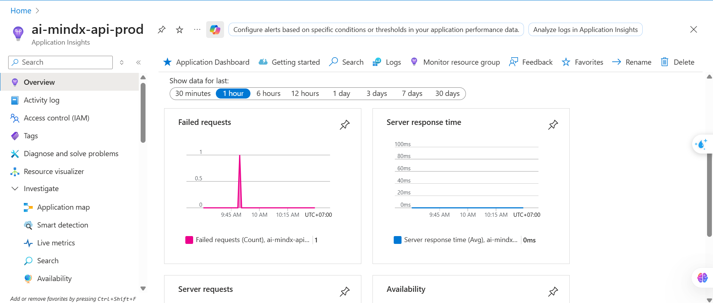
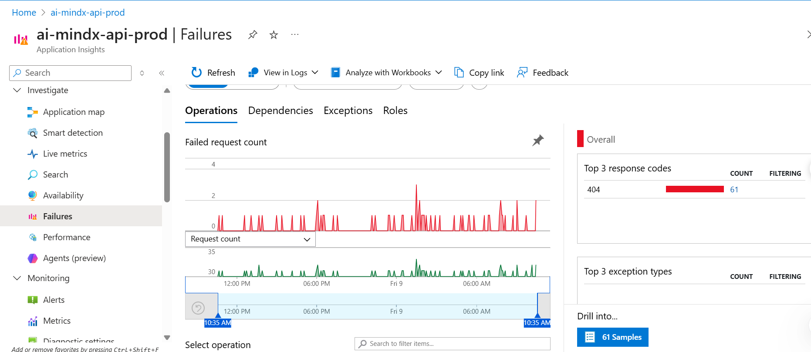
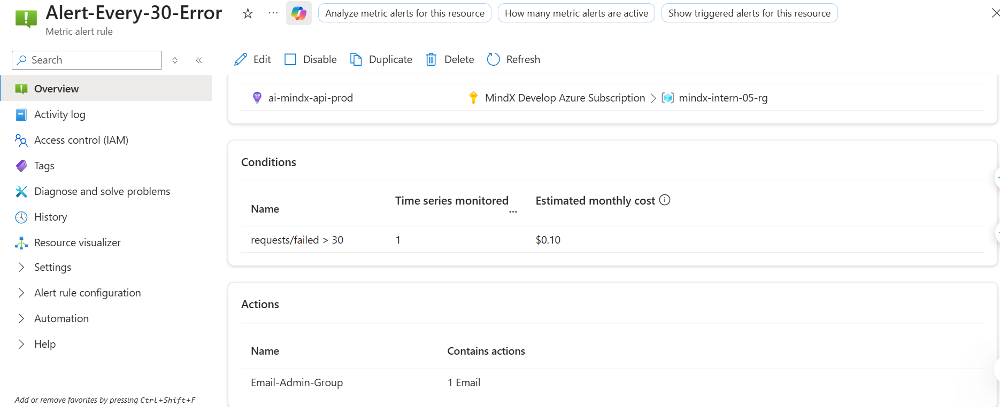
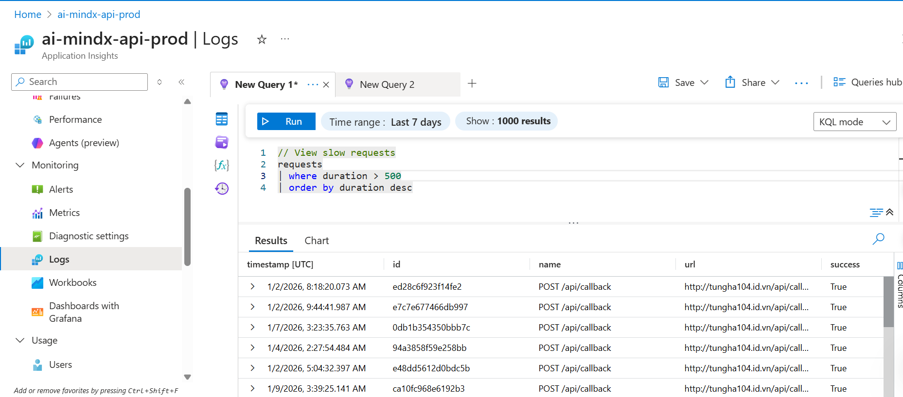
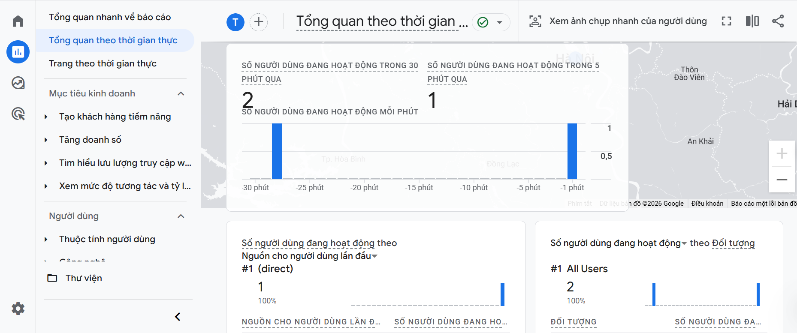
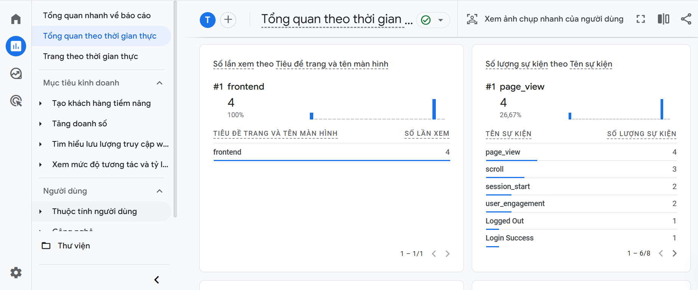
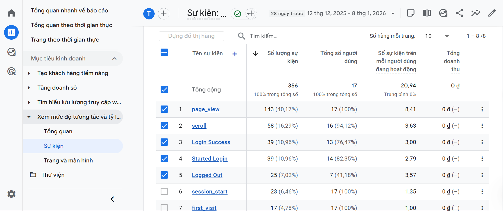

# Metrics & Monitoring Guide

Guide on how to access and interpret metrics from Azure App Insights and Google Analytics.

## 📊 Azure App Insights

### Steps to establish App Insight connection
1. Access Dashboard, choose **Application Insights** and create.

2. In backend, install *applicationinsights* library and configure the parameters at the top of entire code.
3. In frontend, install *@microsoft/applicationinsights-web* library and Initialize App Insights and attach trackEvent to each activity (e.g login, logout, ...)
4. After deploy, access investigate (in the app insights web) to view the details.


### Access
1. Log in to [Azure Portal](https://portal.azure.com)
2. Find **Application Insights** resource
3. Go to **Overview** or **Logs** to view metrics


### Key Metrics

#### Overview
- **Request Rate**: Requests per second
- **Response Time**: Response time (p50, p95, p99)
- **Failed Requests**: Error rate


#### Failures
- **Exceptions**: Errors in code (stack trace)
- **Failed Requests**: HTTP 4xx/5xx
- **Dependencies**: Errors when calling external services


### Alerts
- Alerts are configured in Azure Portal
- Receive email notifications when:
  - Exception rate > threshold
  - Response time > threshold
  - Failed requests > threshold


### Logs Query (KQL)
```kusto
// View recent exceptions
exceptions
| where timestamp > ago(1h)
| order by timestamp desc

// View slow requests
requests
| where duration > 1000
| order by duration desc
```


## 📈 Google Analytics

### Steps to establish Google Analytics connection
1. Create **Google Analytics** in https://analytics.google.com and get **Google Analytics ID**
2. Install *react-ga4* library and configure frontend
3. Add **ReactGA.send** or **ReactGA.event** for each activity, event 

### Access
1. Go to [Google Analytics](https://analytics.google.com)
2. Select the corresponding property
3. View **Reports** > **Realtime** or **Engagement**


### Key Metrics

#### Engagement
- **Page Views**: Number of page views
- **Sessions**: Number of user sessions
- **Users**: Number of unique users

#### Events
- **Scroll**: User scrolls page
- **Page_view**: Number of website visits
- **Login Started**: User starts login
- **Login Success**: Login successful
- **Login Failed**: Login failed
- **Logged Out**: User logged out



### View Events
1. **Reports** > **Engagement** > **Events**
2. Filter by event name or category
3. View count and conversion rate


### Custom Reports
Create custom reports to track:
- Login conversion rate
- User retention
- Popular pages

## 🔍 Comparison

| Metric | Azure App Insights | Google Analytics |
|--------|-------------------|------------------|
| **Purpose** | Production monitoring | Product analytics |
| **Focus** | Errors, performance | User behavior |
| **Data** | Technical metrics | Business metrics |
| **Alerts** | ✅ Yes | ❌ No |

## 💡 Best Practices

1. **Azure App Insights**: Check daily to detect errors early
2. **Google Analytics**: Review weekly to understand user behavior
3. **Alerts**: Set up reasonable thresholds to avoid spam
4. **Dashboards**: Create custom dashboards for important metrics
